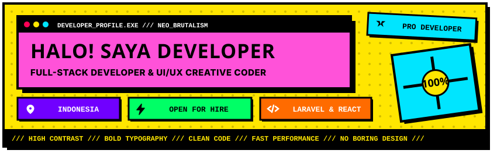

<!-- 
  =============================================================
  NEO-BRUTALISM GITHUB PROFILE README (STREAMLINED & CONCISE)
  =============================================================
-->

<!-- 1. HERO HEADER BANNER -->

  

 

<!-- 2. ABOUT ME -->
<table border="4" width="100%">
  <tr>
    <td bgcolor="#FFE600" width="100%">
      <h2 align="center"><b>ABOUT ME / TENTANG SAYA</b></h2>
    </td>
  </tr>
  <tr>
    <td bgcolor="#FFFFFF" style="padding: 14px;">
      

        <b>Halo!</b> Saya <b>Full-Stack Web Developer</b> yang berfokus pada pembuatan aplikasi web modern, performa tinggi, dan antarmuka berdesain <b>Neo-Brutalism</b> yang bersih dan berani.
      

      <ul>
        <li><b>Fokus Saat Ini:</b> Web Application (<code>Laravel</code> & <code>React</code>) & <code>Next.js</code>.</li>
        <li><b>Spesialisasi:</b> Full-Stack Web Development, REST API, & Responsive UI/UX.</li>
        <li><b>Status:</b> Terbuka untuk kesempatan kerja <b>Full-Time</b> & project <b>Freelance</b>.</li>
      </ul>
    </td>
  </tr>
</table>

 

<!-- 3. TECH STACK (FULL SVG GRAPHIC) -->

  

 

<!-- 4. WORK EXPERIENCE -->
<table border="4" width="100%">
  <tr>
    <td bgcolor="#00E5FF" colspan="2">
      <h2><b>WORK EXPERIENCE / PENGALAMAN KERJA</b></h2>
    </td>
  </tr>
  
  <!-- Role 1 -->
  <tr>
    <td bgcolor="#FFE600" width="28%" align="center">
      <b>2023 - SEKARANG</b> 
      <kbd>FULL-TIME</kbd>
    </td>
    <td bgcolor="#FFFFFF" style="padding: 10px;">
      <h3><b>Senior Full-Stack Developer</b></h3>
      
Pengembangan aplikasi web enterprise, arsitektur database, dan integrasi Payment Gateway & REST API.

      
<b>Tech:</b> <code>Laravel</code> • <code>React.js</code> • <code>TailwindCSS</code> • <code>MySQL</code>

    </td>
  </tr>

  <!-- Role 2 -->
  <tr>
    <td bgcolor="#FF52D9" width="28%" align="center">
      <b>2022 - 2023</b> 
      <kbd>CONTRACT</kbd>
    </td>
    <td bgcolor="#FFFFFF" style="padding: 10px;">
      <h3><b>Web Developer @ Digital Agency</b></h3>
      
Pengembangan 15+ website custom, e-commerce, dan slicing Figma ke kodingan pixel-perfect.

      
<b>Tech:</b> <code>PHP</code> • <code>JavaScript</code> • <code>Bootstrap</code> • <code>MySQL</code>

    </td>
  </tr>
</table>

 

<!-- 5. FEATURED PROJECTS -->
<table border="4" width="100%">
  <tr>
    <td bgcolor="#7000FF" colspan="2" align="center">
      <h2 style="color:white;"><b>FEATURED PROJECTS / PORTOFOLIO</b></h2>
    </td>
  </tr>
  <tr>
    <!-- Project 1 -->
    <td bgcolor="#FFFFFF" width="50%" style="padding: 12px;">
      <table border="2" width="100%">
        <tr>
          <td bgcolor="#FFE600"><b>E-Commerce Platform</b></td>
        </tr>
      </table>
      
Platform e-commerce modern dengan sistem checkout instan, manajemen stok, dan dashboard admin.

      
<b>Tech:</b> <code>Laravel</code>, <code>React</code>, <code>TailwindCSS</code>

      

        <a href="https://github.com/username/project-1"><b>GitHub Repo</b></a> | 
        <a href="https://demo-project.com"><b>Live Demo</b></a>
      

    </td>

    <!-- Project 2 -->
    <td bgcolor="#FFFFFF" width="50%" style="padding: 12px;">
      <table border="2" width="100%">
        <tr>
          <td bgcolor="#00E5FF"><b>Task Management SaaS</b></td>
        </tr>
      </table>
      
Aplikasi SaaS manajemen tugas tim berbasis Kanban Board dengan fitur drag-and-drop real-time.

      
<b>Tech:</b> <code>Next.js</code>, <code>TypeScript</code>, <code>MongoDB</code>

      

        <a href="https://github.com/username/project-2"><b>GitHub Repo</b></a> | 
        <a href="https://demo-project2.com"><b>Live Demo</b></a>
      

    </td>
  </tr>
</table>

 

<!-- 6. GITHUB STATS -->
<table border="4" width="100%">
  <tr>
    <td bgcolor="#FF6B00" align="center">
      <h2><b>GITHUB STATISTIK</b></h2>
    </td>
  </tr>
  <tr>
    <td bgcolor="#FFFFFF" align="center">
       
      
      &nbsp;
      
        
    </td>
  </tr>
</table>

 

<!-- 7. CONNECT WITH ME -->
<table border="4" width="100%">
  <tr>
    <td bgcolor="#00FF66" align="center">
      <h2><b>CONNECT WITH ME / KONTAK</b></h2>
    </td>
  </tr>
  <tr>
    <td bgcolor="#FFFFFF" align="center">
       
      

        <a href="https://linkedin.com/in/YOUR_LINKEDIN"><b>LinkedIn</b></a> &nbsp;|&nbsp; 
        <a href="https://instagram.com/YOUR_INSTAGRAM"><b>Instagram</b></a> &nbsp;|&nbsp; 
        <a href="mailto:emailkamu@example.com"><b>Email</b></a> &nbsp;|&nbsp; 
        <a href="https://wa.me/628XXXXXXXXXX"><b>WhatsApp</b></a> &nbsp;|&nbsp; 
        <a href="https://yourportfolio.com"><b>Portfolio Website</b></a>
      

       
    </td>
  </tr>
</table>

 

<!-- 8. FOOTER BANNER -->

  

